# Manual de usuario — Explora Candelaria
Rama-Daniela · Edición 2.0 · 9 de octubre de 2026

## ¿Qué es Explora Candelaria?

Explora Candelaria es un sistema web que reúne información turística de La Candelaria y permite consultar establecimientos y solicitar reservas de sus servicios. Las personas pueden explorar sitios turísticos, actividades y festividades; los turistas registrados pueden reservar y dar seguimiento a sus solicitudes. La administración mantiene la información turística y los emprendimientos gestionan su oferta y sus reservas.

## Características del sistema

El sistema organiza sus funciones según el rol de la cuenta. Las siguientes características corresponden a la rama Rama-Daniela, utilizada como referencia para este manual.

## Funciones disponibles

Las principales funciones son:

1. Consulta pública de sitios turísticos, actividades, festividades y mapa turístico.
2. Búsqueda de emprendimientos y servicios por categoría.
3. Registro de turistas con confirmación de correo y acceso a su historial.
4. Solicitud de reservas con selección de fechas, cantidades y carrito.
5. Envío y revisión de imágenes de comprobantes de pago.
6. Administración de emprendimientos y publicaciones turísticas.
7. Gestión de servicios, reservas, información comercial y datos de pago del emprendimiento.
8. Consulta y descarga de reportes según el rol.

**Resultado esperado:** Cada usuario dispone de los módulos correspondientes a su cuenta.

## Guía de uso · 1. Introducción y acceso

Este manual explica cómo utilizar el sistema de reservas turísticas de La Candelaria según las funciones de la rama Rama-Daniela. Está dirigido a turistas, administradores y responsables de emprendimientos. Las capturas muestran la interfaz real ejecutada en un entorno local con datos ficticios de demostración. Los nombres, teléfonos, cuentas bancarias, precios y reservas de ejemplo no corresponden a operaciones reales.

## 1.1. Identificar tu rol

Reconocer las opciones que corresponden a tu cuenta.

1. Turista: consulta atractivos, busca servicios, solicita reservas, revisa su historial y envía comprobantes de pago.
2. Administrador: registra y administra emprendimientos, mantiene sitios turísticos, actividades y festividades, y consulta reportes. El acceso administrativo corresponde a las cuentas de administrador del GAD o superadministrador.
3. Emprendimiento: publica sus servicios, gestiona reservas, consulta reportes y actualiza su información y cuentas bancarias.
4. La navegación pública puede consultarse sin iniciar sesión. Para reservar y acceder a módulos privados necesitas una cuenta habilitada y, cuando el sistema lo solicite, el correo confirmado.

**Resultado esperado:** Después de iniciar sesión, el sistema presenta las opciones autorizadas para tu rol. No necesitas seleccionar un rol en cada acceso.

**Imagen por insertar:** Página de inicio con el logotipo de La Candelaria, el menú público y los accesos para iniciar sesión o registrarse.

## 1.2. Iniciar y cerrar sesión

Entrar al sistema con una cuenta existente.

1. Abre el sistema y selecciona el acceso de inicio de sesión.
2. Escribe el correo electrónico registrado y la contraseña. Revisa que no existan espacios añadidos por error.
3. Pulsa el botón de acceso. Si tienes verificación en dos pasos activada, introduce el código solicitado o utiliza uno de tus códigos de recuperación.
4. Comprueba el panel de destino: el administrador accede a su panel; el emprendimiento a su panel; el turista vuelve al inicio o continúa la reserva que estaba preparando.
5. Para salir, abre el menú de tu cuenta y utiliza la opción de cerrar sesión. Hazlo siempre al terminar en un equipo compartido.

**Resultado esperado:** La sesión queda iniciada y puedes utilizar los módulos de tu rol. Si el sistema rechaza los datos, corrige el correo y la contraseña antes de volver a intentarlo.

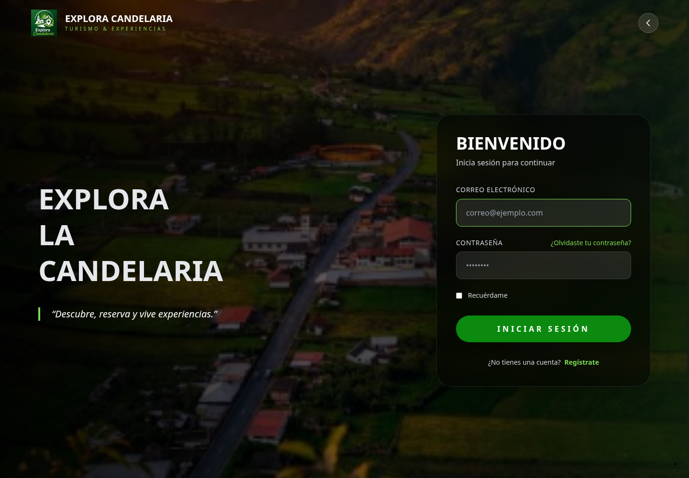

## 1.3. Recuperar la contraseña

Restablecer el acceso cuando no recuerdas tu contraseña.

1. En la pantalla de inicio de sesión, selecciona el enlace de recuperación de contraseña.
2. Introduce el correo asociado a tu cuenta y solicita el enlace de recuperación.
3. Revisa la bandeja de entrada y la carpeta de correo no deseado. Abre el mensaje enviado por el sistema.
4. Sigue el enlace, escribe la nueva contraseña y repítela en la confirmación. Respeta los requisitos que indique el formulario.
5. Guarda la nueva contraseña y vuelve a iniciar sesión.

**Resultado esperado:** Puedes acceder con la nueva contraseña una vez que el restablecimiento finaliza.

**Ten en cuenta:** El envío de correos depende de la configuración del sistema. Si no recibes el mensaje, solicita ayuda al responsable de la plataforma.

**Imagen por insertar:** Pantalla de recuperación con el campo de correo y el botón para enviar el enlace; otra captura opcional del formulario de nueva contraseña.

## Guía de uso · 2. Manual del turista

El turista puede explorar la oferta turística sin sesión. El registro, la confirmación del correo y el inicio de sesión permiten completar reservas y consultar su historial personal. Una solicitud recién creada queda pendiente; la confirmación del establecimiento y la revisión del pago son pasos posteriores.

## 2.1. Crear y confirmar una cuenta

Registrarte como turista para utilizar las reservas.

1. Selecciona el acceso de registro del sistema.
2. Completa nombres, apellidos, cédula ecuatoriana, edad, teléfono y correo electrónico. La cédula debe ser válida y no estar registrada; el teléfono debe tener 10 dígitos. La edad admitida en este registro es de 18 a 99 años.
3. Escribe una contraseña de al menos 8 caracteres con mayúsculas, minúsculas y un símbolo. Repítela exactamente en la confirmación.
4. Envía el formulario y revisa el aviso que indica que tu cuenta está pendiente de confirmación.
5. Abre el correo de verificación y confirma el registro. El enlace de este flujo tiene una vigencia de 30 minutos.
6. Cuando aparezca la confirmación de cuenta creada, inicia sesión. Si estabas preparando una reserva, continúa ese proceso.

**Resultado esperado:** Tu cuenta se crea con el rol turista después de confirmar el correo en el flujo de registro con verificación.

**Ten en cuenta:** Si el enlace ha expirado o es inválido, vuelve a iniciar el registro o solicita apoyo. No compartas el enlace de confirmación ni tu contraseña.

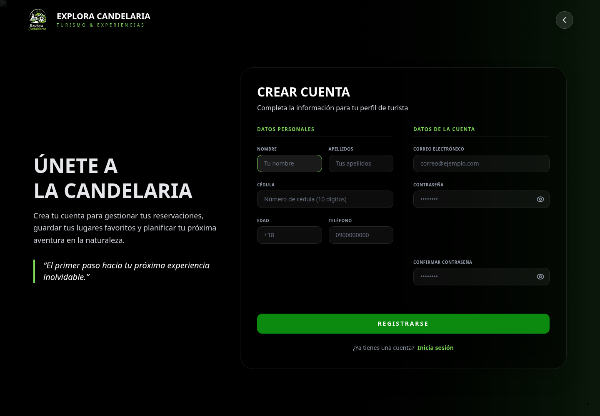

## 2.2. Consultar sitios, actividades y festividades

Encontrar información para planificar tu visita.

1. En el menú público, abre Sitios Turísticos, Actividades o Eventos (festividades), según lo que deseas consultar.
2. Revisa las tarjetas disponibles y utiliza los controles de búsqueda o navegación que muestre esa pantalla.
3. Abre la información del elemento seleccionado mediante su enlace de detalle.
4. En los sitios turísticos, revisa la descripción, fotografías y ubicación disponibles.
5. En las actividades, revisa duración, dificultad y recomendaciones. En las festividades, revisa fechas y actividades programadas.
6. Vuelve al listado para comparar otras opciones antes de organizar tu visita.

**Resultado esperado:** Obtienes la información turística publicada. Consultar una publicación no crea una reserva.

**Ten en cuenta:** La disponibilidad de fotografías y contenido depende de las publicaciones cargadas por la administración.

**Imagen por insertar:** Listado de sitios turísticos con sus tarjetas. Como imágenes complementarias, coloca el listado de actividades y el de festividades.

## 2.3. Consultar el mapa turístico

Ubicar atractivos turísticos en el mapa.

1. Abre Mapa desde la navegación pública.
2. Escribe el nombre de un atractivo en el buscador o utiliza las categorías y filtros visibles.
3. Selecciona un marcador para consultar la información disponible del lugar.
4. Amplía o reduce el mapa y desplázate para explorar el sector. Utiliza únicamente las funciones de ubicación que aparezcan habilitadas.

**Resultado esperado:** Puedes identificar los puntos turísticos cargados en el mapa.

**Ten en cuenta:** Si el mapa no carga, revisa tu conexión. La base del mapa y algunos recursos pueden depender de servicios externos; no todos los puntos necesariamente estarán registrados.

**Imagen por insertar:** Mapa turístico con un marcador seleccionado, el buscador de atractivos y los filtros de categorías visibles.

## 2.4. Buscar emprendimientos y servicios

Encontrar un establecimiento que ofrezca el servicio que necesitas.

1. Abre el buscador de Servicios.
2. Escribe el nombre o término de búsqueda y utiliza el botón de búsqueda cuando esté disponible.
3. Selecciona un tipo de servicio en los filtros: Guianza, Paquetes Turísticos, Alimentación, Hospedaje o Alquiler de Equipos.
4. Revisa los establecimientos encontrados y abre el que te interesa.
5. Dentro del establecimiento, selecciona la categoría que deseas consultar y revisa sus servicios.

**Resultado esperado:** Se muestra la oferta correspondiente al establecimiento y a la categoría elegida.

**Imagen por insertar:** Buscador de servicios con la búsqueda, filtros de categoría y una tarjeta de emprendimiento de demostración.

## 2.5. Seleccionar fechas y preparar el carrito

Elegir servicios y cantidades para una solicitud de reserva.

1. En la página del establecimiento, selecciona el tipo de servicio.
2. Indica la fecha de inicio. El flujo de reserva pública exige al menos 3 días de anticipación. Introduce la fecha final cuando la categoría la solicite.
3. Pulsa la opción de búsqueda o consulta de disponibilidad. Para paquetes turísticos no se admite iniciar la reserva en domingo ni lunes; la duración del paquete determina su fecha final.
4. Revisa descripción, precio y detalles de cada servicio. Ajusta cantidad, número de personas y hora cuando aparezcan estos controles.
5. Agrega los servicios al carrito. Revisa las fechas y el total; elimina cualquier elemento que no quieras reservar.
6. Continúa al resumen de reserva. Si aún no has iniciado sesión, utiliza tu cuenta de turista o completa el registro solicitado.

**Resultado esperado:** El carrito contiene los servicios elegidos y puedes continuar al resumen. Agregar al carrito todavía no registra la reserva.

**Ten en cuenta:** Las cantidades están sujetas al inventario y la disponibilidad. Revisa el importe calculado por el sistema antes de confirmar.

**Imagen por insertar:** Página de servicios de un emprendimiento con filtros de fecha, una habitación de demostración y el carrito lateral.

## 2.6. Enviar la solicitud de reserva

Registrar una solicitud con los servicios del carrito.

1. En el resumen, comprueba los servicios, cantidades, fechas, horarios y total a pagar.
2. Si necesitas corregir algo, vuelve a la selección y modifica el carrito.
3. Pulsa Confirmar reserva una sola vez y espera la respuesta.
4. Revisa el mensaje de reserva guardada y pendiente de confirmación.
5. Abre Mis reservas para consultar la solicitud y esperar la respuesta del establecimiento.

**Resultado esperado:** La solicitud queda en estado Pendiente. No significa todavía que el establecimiento haya confirmado ni que el pago esté aprobado.

**Ten en cuenta:** El sistema permite completar este flujo solo a cuentas de turista. Si el carrito está vacío, vuelve a seleccionar un servicio.

**Imagen por insertar:** Resumen de reserva o checkout con servicios, fechas, total y botón Confirmar reserva; utiliza una reserva de ejemplo sin datos personales reales.

## 2.7. Consultar reservas y enviar un comprobante

Dar seguimiento a una solicitud y presentar evidencia del pago.

1. Inicia sesión y abre Mis reservas.
2. Filtra por estado para localizar la reserva: Pendiente, Confirmada, Pago en revisión, Completada o Cancelada.
3. Abre los detalles para revisar servicios, fechas, total y las instrucciones disponibles.
4. Cuando el establecimiento haya confirmado, consulta los datos e instrucciones de pago proporcionados. El sistema muestra un plazo de 24 horas después de la confirmación para realizar el pago.
5. Realiza el pago por el medio indicado por el establecimiento. En el detalle de la reserva Confirmada, selecciona la imagen del comprobante, de máximo 2 MB.
6. Envía el comprobante y comprueba el aviso de envío a revisión. Vuelve al historial para consultar el nuevo estado.

**Resultado esperado:** Después del envío correcto, el estado cambia a Pago en revisión. El establecimiento revisa la evidencia de pago.

**Ten en cuenta:** Subir una imagen no realiza una transferencia bancaria. Envía un comprobante legible correspondiente a esa reserva y evita enviarlo varias veces.

**Imagen por insertar:** Historial del turista con reservas de distintos estados. Imagen complementaria: detalle de una reserva Confirmada con el campo para subir el comprobante.

## 2.8. Cancelar una reserva

Cancelar una solicitud cuando la opción esté habilitada.

1. Abre Mis reservas y localiza la solicitud.
2. Entra en su detalle y verifica si aparece la opción de cancelación.
3. Selecciona Cancelar e indica un motivo de al menos 5 caracteres cuando el formulario lo solicite.
4. Confirma la cancelación y revisa el mensaje de resultado.
5. Comprueba que el estado haya cambiado a Cancelada.

**Resultado esperado:** La solicitud queda cancelada cuando cumple las condiciones del sistema.

**Ten en cuenta:** La cancelación del turista exige más de 24 horas antes del primer servicio. Se admite en Pendiente, o en Confirmada sin comprobante dentro del plazo previsto. En otros estados puede estar bloqueada. Una cancelación en pantalla no equivale a un reembolso; coordina cualquier devolución con el establecimiento.

**Imagen por insertar:** Detalle de una reserva con la opción Cancelar y el cuadro para escribir el motivo de cancelación.

## Guía de uso · 3. Manual del administrador

El administrador del GAD o superadministrador utiliza el panel administrativo para mantener la oferta turística y los emprendimientos. Las funciones disponibles se muestran en su navegación. Utiliza el registro público para cuentas de turista y el asistente administrativo para dar de alta un emprendimiento.

## 3.1. Consultar el panel administrativo

Reconocer los módulos de administración.

1. Inicia sesión con tu cuenta administrativa.
2. Revisa los indicadores y la información del panel.
3. Utiliza el menú lateral para abrir Emprendimientos, Festividades, Sitios turísticos, Actividades turísticas o Reportes.
4. En pantallas pequeñas, despliega el menú mediante el control de navegación visible.

**Resultado esperado:** Accedes al módulo que necesitas según los permisos de tu cuenta.

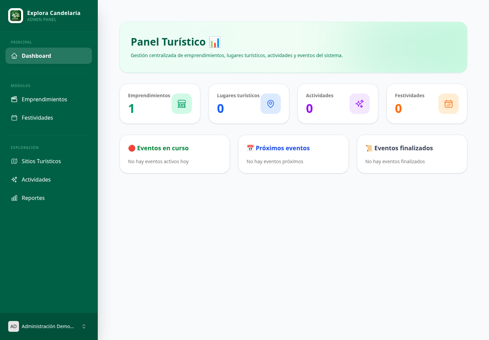

## 3.2. Registrar un emprendimiento

Crear el perfil del establecimiento y su responsable.

1. Abre la gestión de Emprendimientos y selecciona el acceso para registrar uno nuevo.
2. En Datos Personales, completa nombres, apellidos, cédula, edad, teléfono, correo, contraseña y confirmación del responsable. Debe ser mayor de edad y la cédula debe ser válida.
3. Pulsa Siguiente. Corrige cualquier campo señalado antes de avanzar.
4. En Perfil del Emprendimiento, registra el nombre comercial y la descripción. Si corresponde, agrega una imagen en JPG, PNG o WEBP de máximo 5 MB y los enlaces del establecimiento.
5. Continúa al Resumen Final. Revisa los datos del establecimiento y del responsable; utiliza Atrás si necesitas corregirlos.
6. Guarda el registro y comprueba que aparezca en la gestión de emprendimientos.

**Resultado esperado:** El establecimiento queda registrado y asociado a su responsable.

**Ten en cuenta:** La contraseña del responsable exige al menos 8 caracteres, letras, mayúsculas y minúsculas, números y símbolos. No incluyas contraseñas visibles en capturas ni en mensajes públicos.

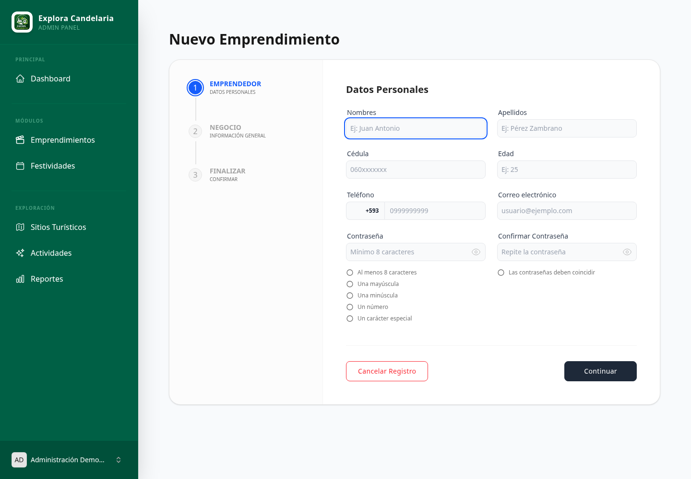

## 3.3. Buscar, editar y cambiar el estado de un emprendimiento

Mantener actualizados los datos de un establecimiento.

1. Abre la gestión de Emprendimientos.
2. Utiliza la búsqueda y los filtros de tipo de servicio o estado que muestre la pantalla.
3. Pulsa el control de detalle para consultar el establecimiento y su responsable.
4. Pulsa Editar para actualizar el nombre comercial, descripción, estado, información del responsable, imagen o enlaces disponibles.
5. Guarda los cambios y comprueba los datos en el listado o en el detalle.
6. Antes de usar Eliminar, verifica que seleccionaste el registro correcto y lee la confirmación de la pantalla.

**Resultado esperado:** El listado refleja los cambios aceptados por el sistema.

**Ten en cuenta:** Al pasar un emprendimiento a Inactivo, el sistema impide el acceso operativo de su responsable y puede cerrar su sesión. No uses este cambio de estado como sustituto de una corrección de datos.

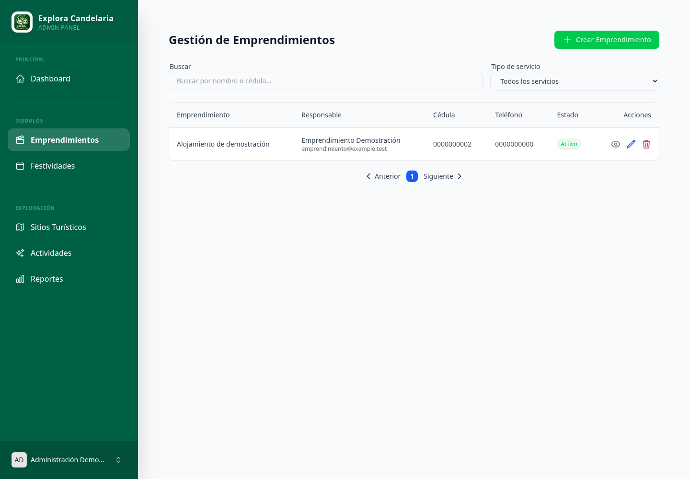

## 3.4. Administrar sitios turísticos

Publicar y actualizar los sitios que consulta el turista.

1. Abre Sitios turísticos en el menú administrativo.
2. Usa la opción de nuevo registro e introduce el nombre y la descripción; completa la ubicación cuando el formulario la muestre.
3. Guarda y comprueba que el sitio aparezca en el listado.
4. Utiliza Editar para modificar la información.
5. Abre la galería para subir imágenes de máximo 5 MB por archivo. Retira una imagen solo cuando hayas verificado que es la correcta.
6. Comprueba la información pública del sitio. Si necesitas eliminar el registro, utiliza su acción de eliminación y confirma conscientemente.

**Resultado esperado:** El sitio queda disponible en el listado administrativo y, cuando la publicación se muestra correctamente, en la consulta pública.

**Ten en cuenta:** En esta rama se detectó una referencia inconsistente a la vista del detalle público del sitio. Si el listado abre pero el detalle falla, informa al responsable técnico; no vuelvas a crear el sitio para intentar resolverlo.

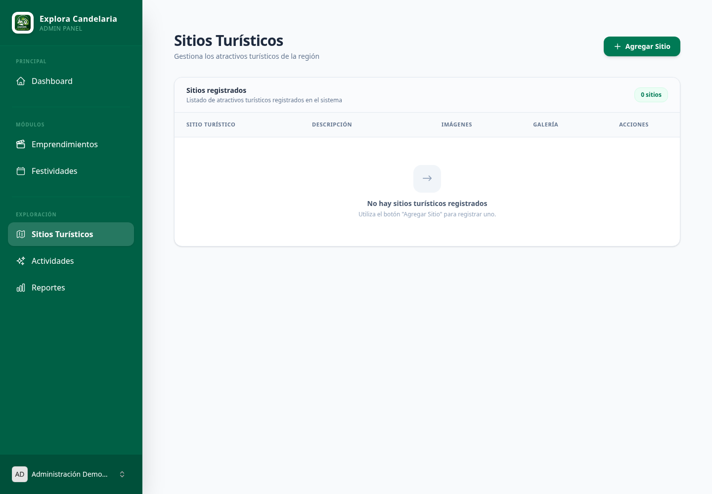

## 3.5. Administrar actividades turísticas

Mantener actividades independientes de las festividades.

1. Abre Actividades turísticas y selecciona el registro de una nueva actividad.
2. Completa nombre, descripción, duración estimada, dificultad y recomendaciones.
3. Agrega las imágenes cuando corresponda; la validación admite imágenes de máximo 5 MB.
4. Guarda y revisa la tarjeta o fila generada.
5. Utiliza Editar para actualizar datos y las opciones de imagen para mantener la galería. Confirma con cuidado la eliminación de una actividad.

**Resultado esperado:** La actividad queda registrada con la información necesaria para planificar una visita.

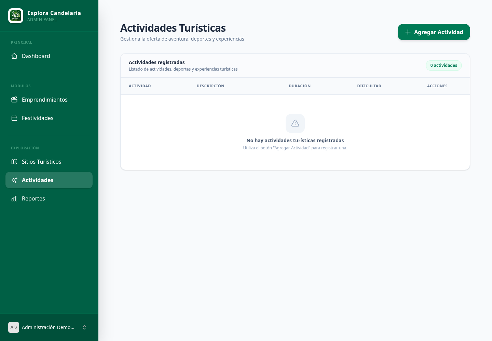

## 3.6. Administrar festividades y su programación

Registrar una festividad y las actividades que forman parte de ella.

1. Abre Festividades y utiliza la opción de registro.
2. Completa el nombre, descripción, fecha de inicio y fecha de fin. Comprueba que el periodo escrito sea correcto.
3. Guarda la festividad y selecciónala en el listado o calendario.
4. En su programación, agrega cada actividad con nombre, fecha, hora, lugar y descripción. La imagen de esa actividad es opcional y admite hasta 2 MB.
5. Gestiona la galería de la festividad cuando necesites imágenes adicionales; la carga de esta galería admite imágenes de hasta 5 MB.
6. Revisa la programación y las opciones de edición o eliminación antes de publicar cambios a la planificación.

**Resultado esperado:** La festividad muestra su periodo y la programación de actividades asociada.

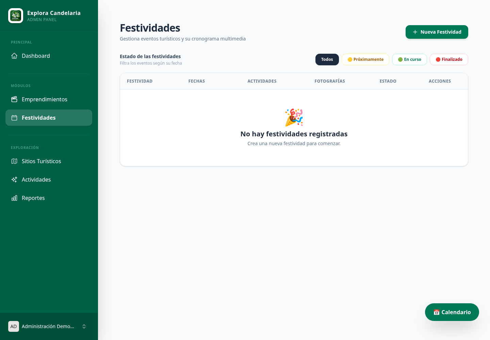

## 3.7. Consultar y descargar reportes administrativos

Obtener un resumen de la información registrada.

1. Abre Reportes.
2. Selecciona la sección disponible: General, Festividades, Sitios, Actividades o Emprendimientos.
3. Revisa los totales y la vista previa del reporte elegido.
4. Utiliza la opción de generar o descargar PDF.
5. Abre el archivo descargado y comprueba que corresponde a la sección seleccionada.

**Resultado esperado:** Dispones del reporte administrativo elegido para consulta o archivo.

**Ten en cuenta:** Los reportes administrativos muestran registros y totales del sistema; revisa su contenido antes de compartirlos fuera de la organización.

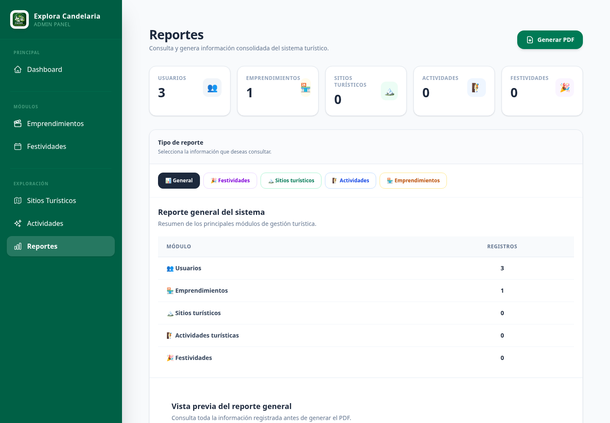

## 3.8. Consideraciones sobre la gestión de usuarios

Conocer el alcance real del módulo de usuarios de esta rama.

1. Utiliza el registro público y la confirmación por correo para crear cuentas de turista.
2. Utiliza Nuevo Emprendimiento para registrar al responsable y su establecimiento.
3. Si la administración te facilita acceso al módulo de Usuarios, puedes consultar las cuentas y sus roles.
4. No intentes registrar usuarios desde un formulario incompleto: informa al responsable técnico si faltan campos requeridos.

**Resultado esperado:** Evitas crear cuentas incompletas y utilizas los flujos disponibles con formularios completos.

**Ten en cuenta:** La ruta de Usuarios existe, pero no aparece en el menú administrativo revisado. Su formulario visible omite contraseña, cédula y teléfono, exigidos por su validación. Este manual no presenta ese registro incompleto como un procedimiento operativo.

**Imagen por insertar:** Si el módulo está habilitado, captura Usuarios Registrados mostrando solo cuentas de demostración y sus roles.

## Guía de uso · 4. Manual del emprendimiento

El responsable necesita una cuenta con el rol emprendimiento y un establecimiento asociado y activo. Su panel reúne servicios, reservas, reportes y configuración. Los registros y acciones se limitan a su propio establecimiento.

## 4.1. Consultar el panel del emprendimiento

Revisar el punto de entrada de la operación diaria.

1. Inicia sesión con la cuenta de responsable del emprendimiento.
2. Revisa los indicadores del panel y las opciones del menú.
3. Abre Servicios para mantener la oferta, Reservas para atender solicitudes o Reportes para revisar la información disponible.
4. Si el sistema informa que el emprendimiento está inactivo o no está asignado, solicita al administrador que revise tu cuenta y establecimiento.

**Resultado esperado:** Accedes a los módulos operativos de tu emprendimiento.

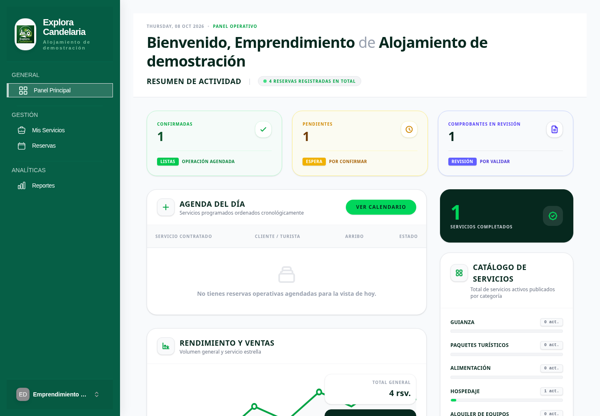

## 4.2. Configurar los tipos de servicio

Indicar las categorías que ofrece tu establecimiento.

1. Abre Mis Servicios y pulsa Configurar Categorías.
2. En la pantalla ¿Qué tipos de servicio ofreces?, selecciona una o más categorías.
3. Utiliza las categorías del catálogo: Guianza, Paquetes Turísticos, Alimentación, Hospedaje y Alquiler de Equipos.
4. Pulsa Guardar y comprueba la notificación de configuración completada.
5. Verifica que las categorías elegidas aparezcan en Gestión de Servicios.

**Resultado esperado:** El establecimiento queda asociado a las categorías seleccionadas.

**Ten en cuenta:** Debes seleccionar al menos una categoría. Revisa las categorías antes de guardar cambios en una configuración existente.

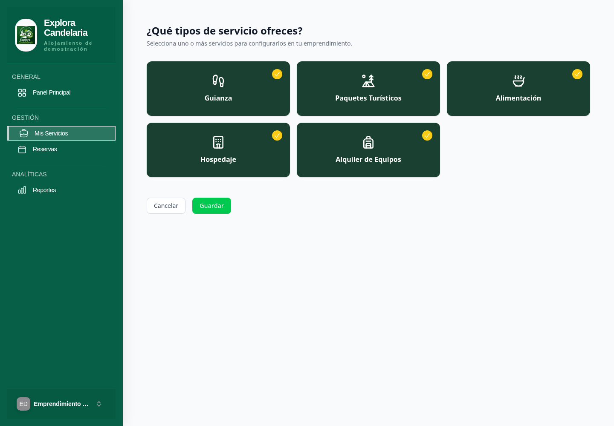

## 4.3. Crear servicios por categoría

Registrar la oferta que podrá consultar y reservar el turista.

1. Abre Gestión de Servicios y selecciona la pestaña de la categoría.
2. Pulsa Nuevo en la categoría seleccionada.
3. Completa el nombre, descripción y precio. Introduce el importe numérico con un máximo de dos decimales.
4. Completa los campos específicos de la categoría según la guía siguiente y las indicaciones del formulario.
5. Guarda y comprueba que el nuevo servicio aparezca en el listado. Si hay errores, corrige los campos señalados y vuelve a guardar.

**Resultado esperado:** El servicio queda registrado en la categoría correspondiente.

**Ten en cuenta:** Hospedaje: stock y capacidad. Guianza: stock y número máximo de personas. Alimentación: tipo y lugar de alimentación. Alquiler de Equipos: stock. Paquetes Turísticos: stock, lugar y hora de salida, servicios incluidos, lugares y actividades, recomendaciones y duración en días; puede incluir mensaje de pago y documento PDF de hasta 5 MB. El formulario de alimentación limita el precio a 100; los otros formularios de alta revisados lo limitan a 1000.

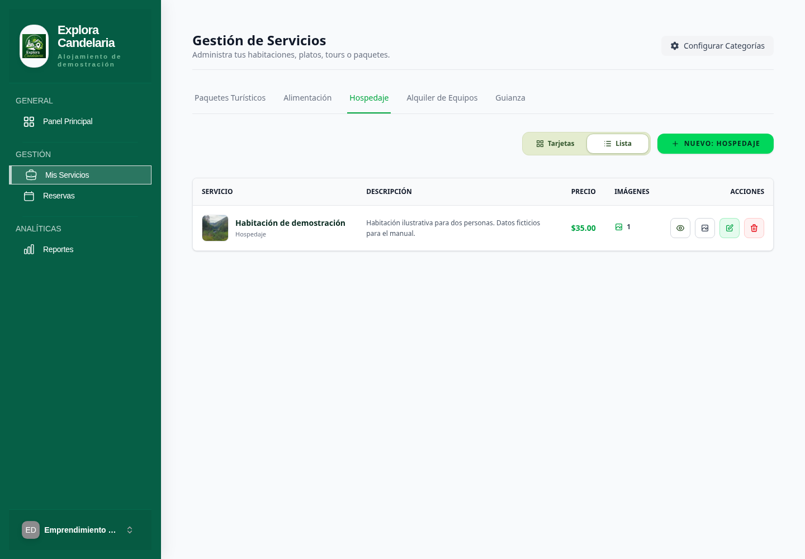

## 4.4. Editar servicios y gestionar imágenes

Mantener la información y presentación de tus servicios.

1. En Gestión de Servicios, selecciona la categoría y localiza el registro.
2. Usa Detalle para revisar la información antes de modificarla.
3. Pulsa Editar, actualiza los campos que muestre el formulario y guarda.
4. Cuando el servicio tenga disponible la opción de galería, ábrela, selecciona las imágenes y utiliza la acción de guardar o sincronizar.
5. Revisa las fotografías después de la carga y elimina solo las que ya no deban mostrarse.
6. Si necesitas retirar un servicio, utiliza su acción Eliminar y revisa la confirmación.

**Resultado esperado:** Los cambios aceptados se reflejan en el catálogo del establecimiento.

**Ten en cuenta:** La galería no está habilitada para Guianza en la lógica revisada. Respeta los límites de archivo que muestre cada formulario. Eliminar un servicio no equivale a cancelar automáticamente todas las reservas relacionadas.

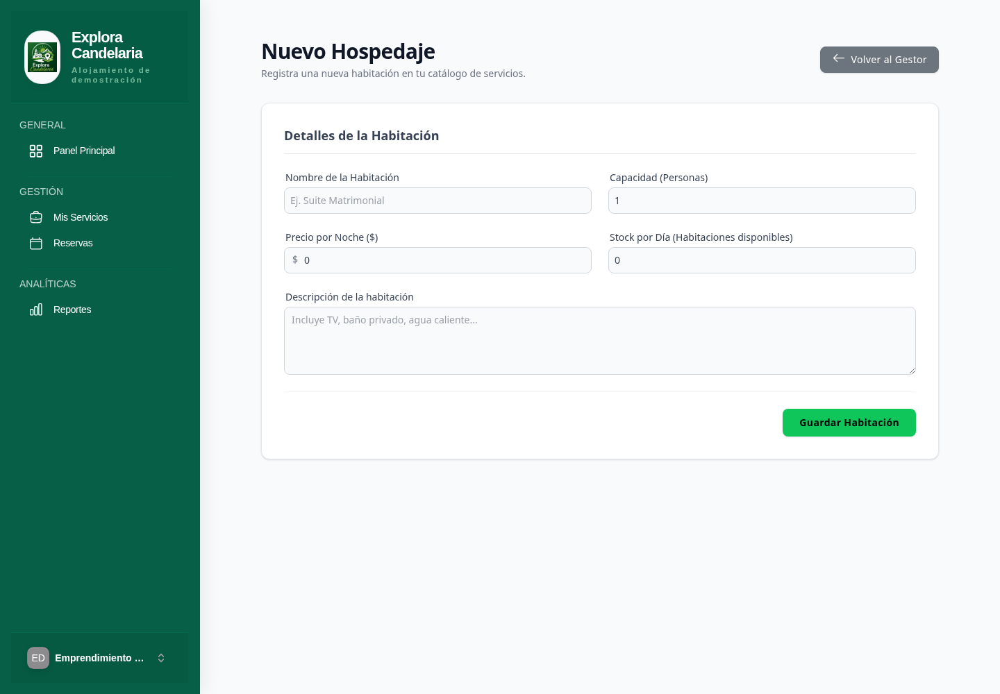

## 4.5. Revisar solicitudes y confirmar reservas

Atender las solicitudes que recibes de los turistas.

1. Abre Reservas.
2. Utiliza los filtros de estado, categoría o búsqueda por cédula para localizar la solicitud.
3. Abre el detalle y revisa al turista, los servicios, fechas, cantidades y total.
4. Para una solicitud Pendiente, pulsa Confirmar reserva cuando estés en condiciones de atenderla.
5. Verifica el cambio de estado y revisa las siguientes acciones disponibles. El turista podrá proceder con el pago y el envío de comprobante.
6. Para cancelar, usa la acción correspondiente e indica el motivo solicitado. Evita confirmar solicitudes que no puedas atender.

**Resultado esperado:** La reserva aceptada queda Confirmada y continúa el flujo de pago.

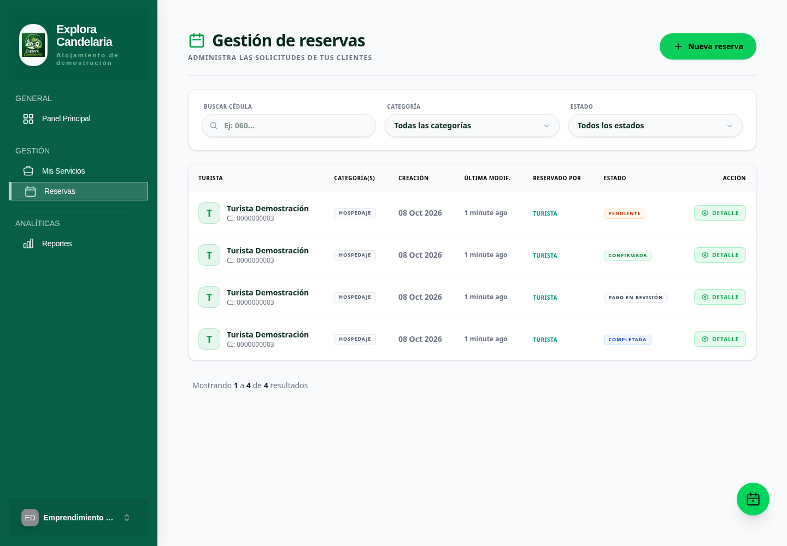

## 4.6. Revisar pagos y reagendar

Gestionar comprobantes y cambios de fecha.

1. En Reservas, busca una solicitud en Pago en revisión y abre el detalle.
2. Pulsa Abrir comprobante y contrasta la evidencia con el pago recibido y el importe de la reserva.
3. Si corresponde, utiliza Marcar completada. Verifica el estado después de guardar la acción.
4. Para modificar fechas, abre la reserva y utiliza Reagendar cuando esté habilitado.
5. Introduce las nuevas fechas y horarios por servicio, revisa la disponibilidad y guarda. En paquetes turísticos no se admite reagendar el inicio en domingo ni lunes.
6. Verifica el resultado y comunica cualquier ajuste necesario al turista mediante los canales habituales.

**Resultado esperado:** El estado o las fechas quedan actualizados cuando la acción es aceptada por el sistema.

**Ten en cuenta:** Revisa los pagos oportunamente. El texto de aviso de esta rama y la lógica de aprobación automática muestran plazos distintos; no dependas de la aprobación automática para validar un pago. Marcar completada es una decisión del responsable y debe corresponder a una revisión real.

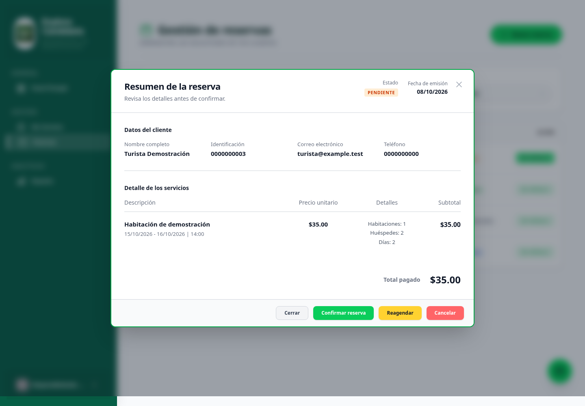

## 4.7. Crear una reserva para un turista registrado

Registrar una reserva desde el panel del establecimiento.

1. En Reservas, abre el acceso de nueva reserva.
2. Selecciona categoría y fechas; consulta disponibilidad y agrega al carrito los servicios solicitados.
3. Continúa al paso Datos del turista e introduce su cédula de 10 dígitos.
4. Pulsa Buscar y verifica los datos recuperados. En esta pantalla los datos son de solo lectura; si no se encuentra el turista, solicita que complete su registro antes de continuar.
5. Avanza al resumen y revisa carrito, datos personales y total.
6. Utiliza la acción de finalizar el agendamiento y comprueba que la reserva aparezca en la gestión.

**Resultado esperado:** La reserva creada desde este flujo queda Confirmada.

**Ten en cuenta:** Este flujo requiere un turista existente encontrado por cédula. No escribas datos de otra persona para completar una búsqueda sin resultado.

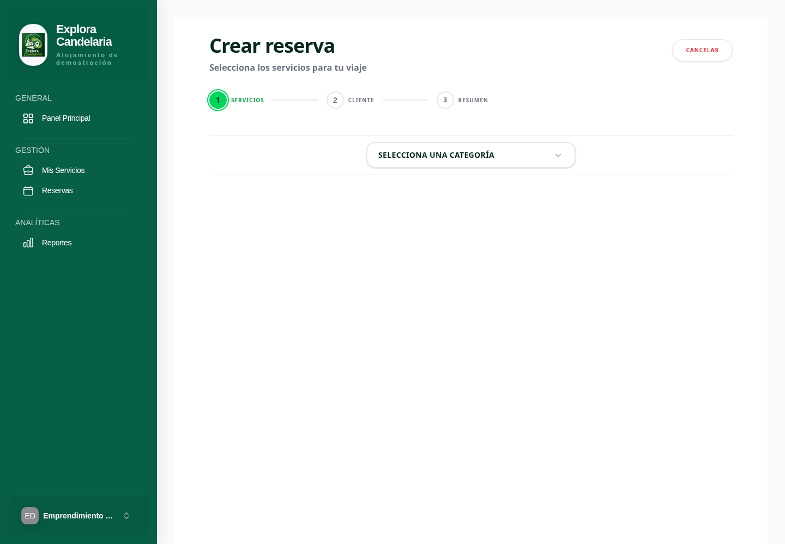

## 4.8. Consultar y descargar reportes del emprendimiento

Revisar la actividad de tu establecimiento.

1. Abre Reportes.
2. Selecciona fecha desde y fecha hasta. Al abrir la pantalla se propone el periodo desde el inicio del mes hasta el día actual.
3. Aplica los filtros de categoría, estado, nombre del servicio, cédula o tipo de reporte que estén disponibles.
4. Revisa los totales y los registros obtenidos. Si necesitas empezar de nuevo, utiliza Limpiar filtros.
5. Usa la acción de descarga o exportación y elige el formato que ofrezca la pantalla.
6. Abre el archivo y verifica el periodo y el contenido antes de compartirlo.

**Resultado esperado:** Obtienes información limitada al emprendimiento de tu cuenta.

**Ten en cuenta:** El indicador de recaudación en esta rama suma reservas Confirmadas y Completadas. Una Confirmada puede estar pendiente de comprobante; contrasta el indicador con los pagos reales antes de utilizarlo como informe financiero.

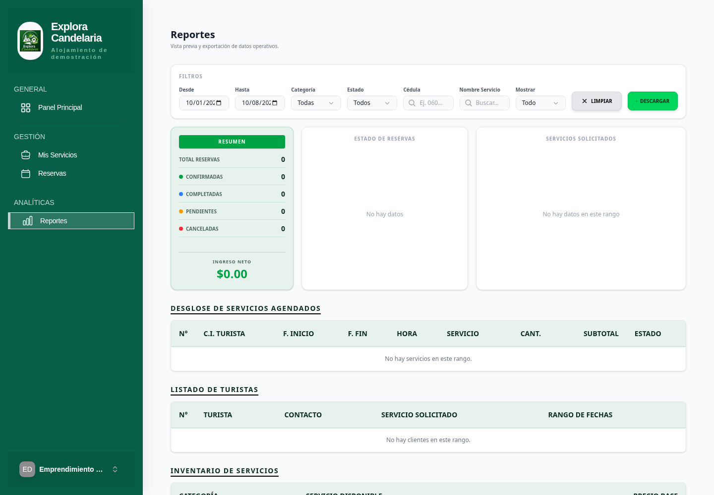

## 4.9. Actualizar el perfil y las cuentas bancarias

Mantener la información comercial y los datos de pago.

1. Abre la configuración de tu cuenta y entra en Datos del emprendimiento.
2. Actualiza la descripción, con una longitud de 10 a 300 caracteres. Puedes cargar una imagen JPG, PNG o WEBP de máximo 5 MB.
3. Agrega o elimina enlaces de redes sociales según sea necesario. Se admiten hasta 10 enlaces distintos con http:// o https://. Guarda los cambios.
4. Abre Datos de pago y pulsa Agregar cuenta.
5. Completa el banco, número de cuenta y titular. Revisa cada dato con especial cuidado.
6. Guarda los cambios. Si retiras una cuenta del formulario, guarda para aplicar la modificación.

**Resultado esperado:** El perfil y las cuentas bancarias quedan actualizados para el establecimiento.

**Ten en cuenta:** El nombre del emprendimiento se muestra en la configuración, pero este formulario guarda descripción, imagen y enlaces. Para cambiar el nombre comercial, solicita el ajuste a la administración. Evita publicar cuentas de demostración como instrucciones de pago reales.

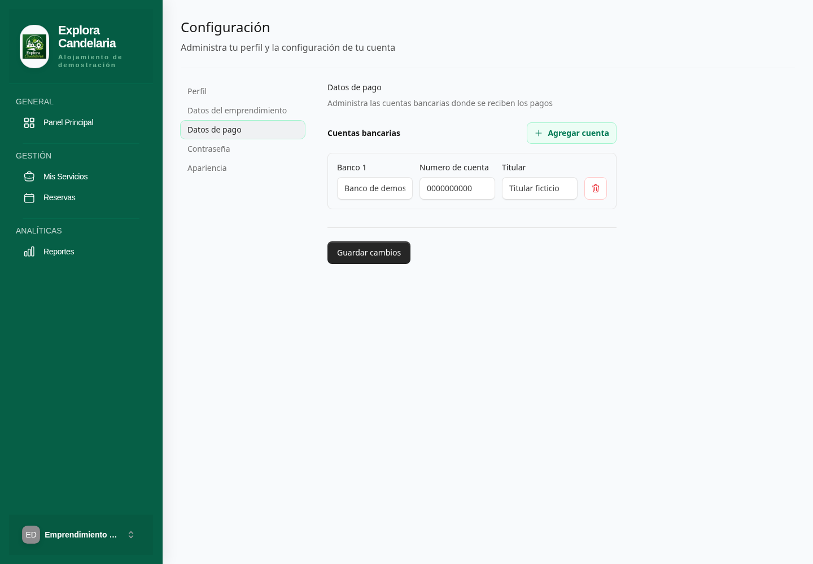

## Guía de uso · 5. Configuración de la cuenta y ayuda

Las opciones personales se abren desde el menú de la cuenta. Utiliza los mensajes del sistema para comprobar cada operación y pide apoyo cuando una acción no esté disponible o no puedas completarla.

## 5.1. Mantener tu perfil y proteger el acceso

Actualizar tu cuenta y sus opciones de seguridad.

1. Abre Configuración o el acceso de perfil desde el menú de tu cuenta.
2. En Perfil, revisa y actualiza los campos que sean editables. Guarda y comprueba la notificación.
3. En Contraseña, introduce la contraseña actual, la nueva y su confirmación; guarda según las indicaciones del formulario.
4. En Apariencia, selecciona el modo claro, oscuro o del sistema cuando estén disponibles.
5. En Verificación en dos pasos, sigue el asistente para vincular una aplicación autenticadora. Guarda los códigos de recuperación en un lugar privado.
6. No compartas contraseñas, códigos ni sesiones. Si decides eliminar tu cuenta y la opción aparece, lee sus advertencias y confirma solo cuando comprendas el alcance.

**Resultado esperado:** Tu configuración personal queda actualizada y puedes mantener un acceso seguro.

**Ten en cuenta:** Cambiar el correo puede requerir una nueva verificación. La eliminación de una cuenta es distinta de cerrar sesión; evita utilizarla para solucionar un error de acceso.

**Imagen por insertar:** Configuración de perfil con datos de demostración y el menú de opciones personales.

## Guía de uso · 6. Problemas frecuentes y cierre

Antes de repetir una operación, comprueba si el sistema ya la registró. Para solicitar ayuda, indica la pantalla, el paso y el mensaje observado. No envíes contraseñas ni códigos de verificación.

## 6.1. Guía rápida de solución

No puedo iniciar sesión · Comprueba el correo y la contraseña. Utiliza recuperación de contraseña si corresponde. Si el emprendimiento está inactivo, contacta a la administración.

No llega el correo de registro · Revisa correo no deseado y confirma que escribiste la dirección correcta. Si el enlace expiró, solicita apoyo o repite el registro. El servicio de correo debe estar operativo.

Cédula o correo ya registrados · Utiliza tu cuenta existente o solicita revisión. No crees varias cuentas para la misma persona.

No puedo seleccionar una fecha · La reserva pública requiere al menos 3 días de anticipación. Para paquetes, no inicies en domingo ni lunes. Revisa también la fecha final y disponibilidad.

No hay disponibilidad · Prueba otras fechas, cantidades o servicios. No confirmes una reserva esperando disponibilidad que el sistema no ofrece.

El carrito aparece vacío · Vuelve al establecimiento y agrega al menos un servicio antes de continuar al resumen.

No aparece subir comprobante · La reserva debe estar Confirmada. Si está Pendiente, espera la respuesta del establecimiento; si ya está en revisión, consulta el estado.

El comprobante no se acepta · Selecciona una imagen legible de hasta 2 MB. No uses un PDF en el campo que exige imagen.

La cancelación está bloqueada · Revisa estado, fecha de inicio y existencia de comprobante. Solicita apoyo al establecimiento; no asumas que existe un reembolso automático.

No se encuentra al turista al agendar · Verifica la cédula y solicita que complete su registro. La pantalla de reserva del emprendimiento recupera personas ya registradas.

No aparece un módulo · Comprueba que ingresaste con el rol correcto. Solicita revisión de permisos; no todas las opciones están disponibles para todos los roles.

Un reporte está vacío · Revisa fechas y filtros. Limpia los filtros y comprueba que existan registros del establecimiento en ese periodo.

Un detalle o una página muestra un error · Anota la pantalla y la acción que realizaste y solicita soporte. Evita repetir cargas o crear registros duplicados.

## 6.2. Estados de reserva

Pendiente · El turista envió la solicitud; todavía espera aceptación. · El emprendimiento revisa y confirma; el turista consulta el historial.

Confirmada · El establecimiento confirmó la reserva. Puede estar pendiente de pago. · El turista revisa instrucciones y presenta comprobante; el responsable da seguimiento.

Pago en revisión · El turista envió una imagen del comprobante. · El emprendimiento revisa la evidencia y el pago recibido.

Completada · La reserva fue marcada completada por el flujo disponible. · Consulta los detalles y coordina la prestación del servicio cuando corresponda.

Cancelada · La reserva fue cancelada por una acción o regla del sistema. · Consulta el motivo y coordina con el establecimiento cualquier cuestión pendiente.

Reagendada / Rechazada · Estos estados también están contemplados en algunas pantallas o reglas. · Revisa el detalle y las indicaciones del establecimiento; no todas las vistas los ofrecen como filtro.

## Anexo. Referencia de la versión y notas de revisión

Base de elaboración: jhinier/proyecto_reservas_turisticas, rama Rama-Daniela, commit b0aad471c381a90eb071c0b2b903a5872c29edb4. Fecha de elaboración: 8 de octubre de 2026 (America/Guayaquil).
El contenido se contrastó con las rutas, vistas y componentes de los tres roles. Las capturas se obtuvieron de la aplicación ejecutada localmente con una base de datos independiente y cuentas ficticias. Son imágenes de interfaz reales; no son diseños generados ni evidencias de operaciones de producción.
Los procedimientos redactados a partir del código no constituyen una certificación de todos los flujos de negocio. Las notificaciones por correo, transferencias bancarias y datos de mapas externos requieren sus servicios reales y no se comprobaron de extremo a extremo para este documento.
Observación sobre pagos: el detalle del emprendimiento contiene un aviso de aprobación a las 12 horas, mientras ReservaService contempla aprobación tras 24 horas y alerta a las 23. La ejecución automática depende además de cuándo se invoque el procesamiento. Se recomienda resolver esta diferencia antes de comunicar un plazo garantizado a los usuarios.
Observación sobre usuarios: existe una ruta de gestión, pero el menú revisado no la muestra y el formulario omite campos obligatorios para guardar. Se documenta como una limitación de la rama.
Observación sobre sitios: LandingController referencia turista.publicacion.detalle-sitio, mientras el archivo de detalle se encuentra bajo livewire/turista/publicacion. Conviene corregir esa referencia antes de dar por validada la pantalla pública de detalle.
Observación sobre reportes: el total recaudado del emprendimiento incluye Confirmadas y Completadas. No debe interpretarse automáticamente como cobros bancarios comprobados.
Las imágenes pendientes tienen una descripción concreta junto al procedimiento. Para sustituirlas, utiliza la pantalla indicada y datos de prueba. Oculta información personal, números de cuenta reales, contraseñas y códigos de seguridad.
Algunas vistas públicas dependen de cdn.tailwindcss.com, bloqueado en la red de esta sesión. Sus capturas sin estilos se descartaron; se incluyeron instrucciones para insertar imágenes fieles cuando ese recurso esté disponible.
Diseño adaptado del documento de referencia Manual de Usuario de Yumpu.pdf facilitado por el usuario: portada, presentación del sistema, características, guía de uso numerada y pies de imagen. El contenido y las pantallas corresponden a Explora Candelaria; no se incorporan funciones de Yumpu.